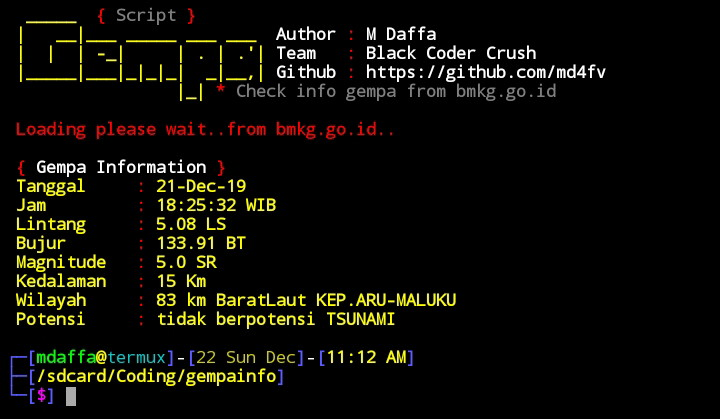

# Info-Gempa (dfvproject)

Gempa is tools for get information of gempa from bmkg.go.id

# Gempa feature
- [x] fast process
- [x] good or bad connection

# Gempa code
- [x] <a href="gempa.py">Python script</a> 
- [x] <a href="gempa.php">Php script</a> 

# Gempa image

